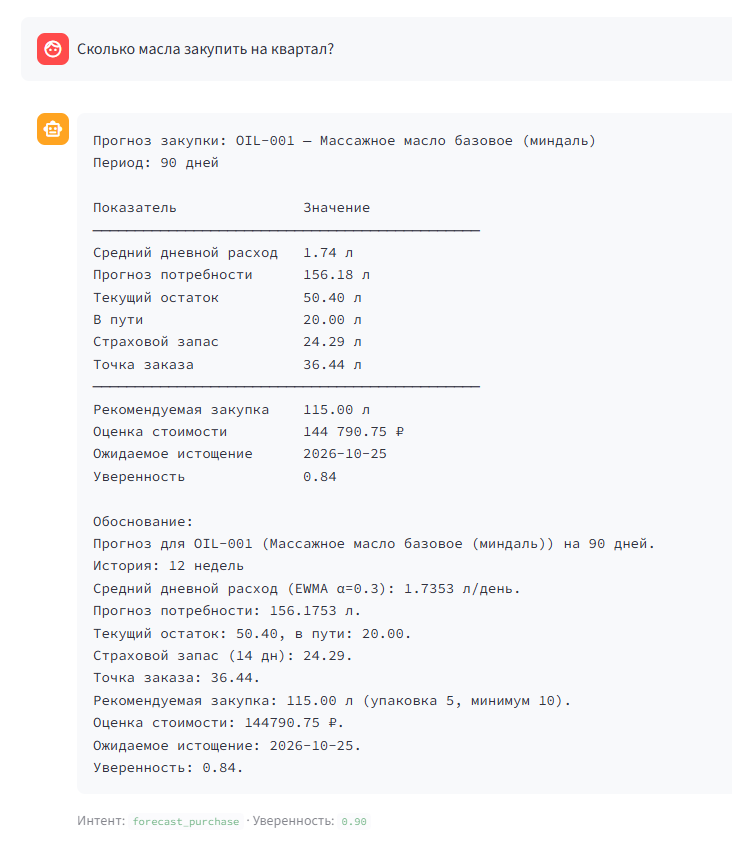
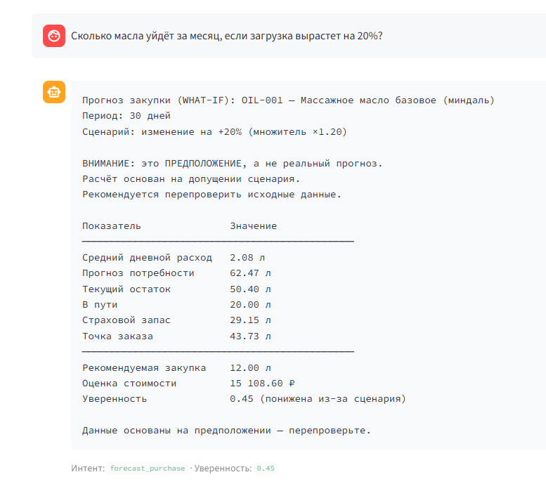
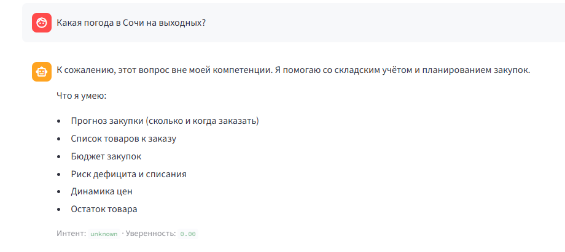
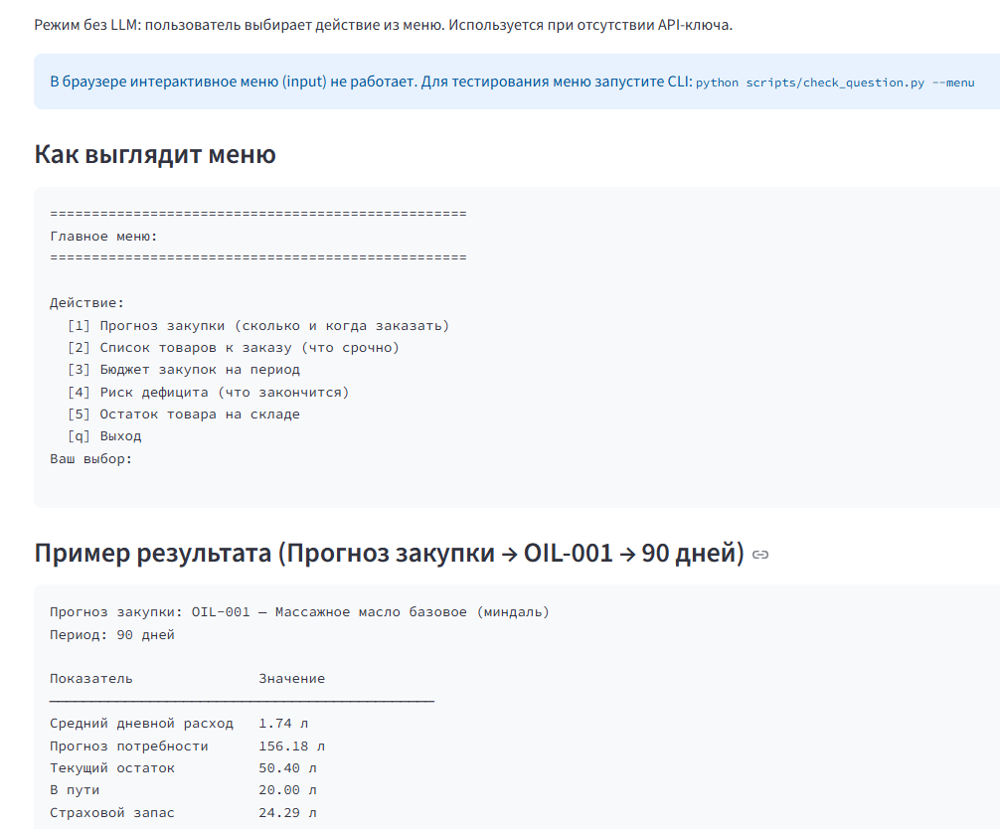

# RESULTS.md — Результаты работы пайплайна

Документ описывает результаты работы пайплайна, выбранные методы 
и обоснования, а также компромиссы и рекомендации.

---

## Часть 1: нормализация записей движения товара

### Организация исходных данных

В ТЗ данные приходят **одним файлом** (`dataset.json` в корне, 
Приложение 1). В репозитории они **разделены по частям** внутри `src/`:

- `src/part1/dataset_part1.json` — записи движения M1–M8;
- `src/part2/dataset_part2.json` — недельный расход, остатки, 
  поставки в пути;
- `src/part3/dataset_part3.json` — 15 вопросов пользователя.

**Обоснование:** в реальной работе эти данные приходят 
из **разных источников**:
- **Part 1** — из WMS / системы складского учёта (движение товара);
- **Part 2** — из ERP / системы планирования (исторический расход, 
  остатки, открытые заказы);
- **Part 3** — из интерфейса пользователя / CRM (вопросы менеджеров).

**Что это даёт:**
- Отражает **реальную архитектуру** данных.
- Готовит код к **интеграции с разными API**.
- Позволяет **независимо тестировать** каждую часть.

`dataset.json` в корне — **копия всех трёх блоков** для 
соответствия ТЗ. См. также `README.md`, раздел «Организация данных».

---

### Что сделано

Реализована функция `normalize_movement(text: str) -> dict`, которая 
извлекает из текстовой записи 8 полей:

| Поле | Тип | Описание |
|------|-----|----------|
| `date` | `str \| None` | ISO-дата (YYYY-MM-DD) |
| `sku` | `str \| None` | Артикул из каталога |
| `location` | `str \| None` | Объект (MS-01, Сочи, ...) |
| `operation` | `str \| None` | receipt / consume / writeoff / return / correction |
| `qty` | `float \| None` | Количество в базовой единице позиции |
| `unit` | `str \| None` | Базовая единица (л, кг, шт, пар) |
| `batch` | `str \| None` | Номер партии |
| `doc_no` | `str \| None` | Номер документа |

Если поле не найдено — возвращается `None`. Результат **всегда** 
содержит все 8 ключей.

---

### Подход: regex + правила, без LLM

**Обоснование выбора:**
1. **Детерминизм.** Тесты (`assert`) требуют воспроизводимого 
   результата. LLM даёт разные ответы на один вход.
2. **Требование ТЗ «не придумывать числа».** Regex извлекает 
   только то, что есть в тексте.
3. **Fallback без API-ключей.** Код работает в любой среде.
4. **Скорость и стоимость.** Regex обрабатывает запись за 
   миллисекунды, LLM — за секунды + токены.
5. **Структура данных известна.** 4 формата дат, 7 единиц, 
   5 операций — всё перечислимо.

---

### Поддерживаемые форматы

**Даты:**
- `dd.mm.yyyy` (05.03.2026) → RU/EU
- `dd.mm.yy` (07.03.26) → RU/EU
- `yyyy-mm-dd` (2026-03-08) → ISO
- `mm/dd/yy` (03/06/26) → US
- `1 марта 2026 г.` → текстовый

**Эвристика:** точка → RU/EU (день.месяц), слэш → US (месяц/день), 
дефис → ISO.

**Единицы:**
- `450 мл` → 0.45 л
- `3,5 кг` → 3.5 кг
- `2 канистры по 5 л` → 10.0 л
- `4 уп. по 50 пар` → 200 пар
- `48 пар`, `120 шт`, `−120 шт`

**Операции:**
- `приход`, `поступление` → `receipt`
- `расход`, `использовано` → `consume`
- `списание`, `истёк срок` → `writeoff`
- `возврат` → `return`
- `корректировка`, `инвентаризация` → `correction`

**Приоритет операций:** correction > return > writeoff > receipt > consume. 
Например, «списание ... истёк срок» → `writeoff`, а не `consume`.

---

### Результаты прогона M1–M8

| ID | date | sku | location | operation | qty | unit | batch | doc_no |
|----|------|-----|----------|-----------|-----|------|-------|--------|
| M1 | 2026-03-05 | OIL-001 | MS-01 | receipt | 10.0 | л | None | НК-345 |
| M2 | 2026-03-01 | OIL-001 | MS-01 | consume | 0.45 | л | B-OIL-001-012 | None |
| M3 | 2026-03-06 | SCRB-020 | Сочи | writeoff | 1.2 | кг | None | None |
| M4 | 2026-03-07 | WRAP-030 | MS-02 | consume | 3.5 | кг | B-WRAP-030-004 | None |
| M5 | 2026-03-12 | OIL-002 | None | return | 2.0 | л | None | None |
| M6 | 2026-03-08 | CONS-051 | MS-01 | consume | 48.0 | пар | None | None |
| M7 | 2026-03-15 | CONS-052 | MS-02 | correction | -120.0 | шт | None | None |
| M8 | None | CONS-051 | Красная Поляна | receipt | 200.0 | пар | None | None |

**Все 8 записей распарсены корректно.**

---

### Ключевые решения

#### 1. Формат `03/06/26` → 6 марта (mm/dd/yy)

Дата `03/06/26` может означать:
- 6 марта (mm/dd/yy, US)
- 3 июня (dd/mm/yy, EU)

**Решение:** 6 марта, потому что:
- Все остальные записи M1–M8 — за **март 2026**.
- Логическая непротиворечивость: если это 3 июня, запись выпадает из периода.

**Эвристика:** точка → RU/EU, слэш → US.

#### 2. M8: сопоставление без SKU

Запись: «Приход тапочек одноразовых, 4 уп. по 50 пар, Красная Поляна» — 
**нет SKU**, только название.

**Решение:** словарь алиасов `SKU_ALIASES`:
```python
"CONS-051": ["тапоч", "тапк"],
"CONS-052": ["шапоч", "шапк"],
```

Находим «тапоч» в тексте → `CONS-051`. Без алиасов нечёткое 
сопоставление через `SequenceMatcher` не срабатывало из-за разных 
окончаний («тапочек» vs «тапочки»).

#### 3. Composite-единицы и морфология

Проблема: `COMPOSITE_UNIT_WORDS = ["канистр", ...]`, а в тексте 
«канистр**ы**». Regex не находил.

**Решение:** добавить `\w*` после альтернатив, чтобы пропустить 
окончание.

#### 4. Negative quantities

Знак минус может быть:
- `-` (U+002D, hyphen)
- `−` (U+2212, unicode minus)

**Решение:** класс `[−\-]` в regex + нормализация через 
`.replace("−", "-")` перед `float()`.

#### 5. Год vs единица измерения

В M5: «Возврат 12 марта 2026 г.: OIL-002, 2 л» — regex мог 
схватить `2026` как `2026 г` (граммы).

**Решение:** фильтр `if unit == "г" and abs(qty) >= 1000: continue` — 
пропускаем 4-значные числа перед «г».

#### 6. Doc_no vs локация

В M1: `MS-01` матчился как `doc_no`, а нужно `НК-345`.

**Решение:** исключаем префикс `MS-`:
```python
if candidate.upper().startswith("MS-"):
    continue
```

Плюс: номера документов в задании **кириллические** (`НК-345`), 
локации и SKU — **латинские** (`MS-01`, `OIL-001`). Разделение 
по алфавиту.

---

### Тесты Части 1

**86 тестов в 3 блоках:**

| Файл | Тестов | Что покрывает |
|------|--------|---------------|
| `test_real_data.py` | 16 | M1–M8 из задания |
| `test_synthetic.py` | 49 + 3 xfail | Тара, падежи, даты, операции, алиасы, границы |
| `test_input_modes.py` | 21 | Ручной ввод, JSON из репозитория, свой JSON |

**`xfail`** — формы «литр», «литра», «грамм» пока не поддерживаются 
(только символьные `л`, `кг`). Задокументировано как известное ограничение.

**Запуск:**
```bash
python -m pytest tests/part1/ -v
```

**Результат:** `86 passed, 3 xfailed`.

---

### CLI для проверки

```bash
# Одна строка вручную
python scripts/check_normalize.py "05.03.2026 MS-01 приход OIL-001 1 л"

# Стандартный dataset
python scripts/check_normalize.py --dataset

# Свой JSON
python scripts/check_normalize.py --json my_records.json

# JSON-вывод
python scripts/check_normalize.py --dataset --output-format json
```

---

## Часть 2: прогноз потребности и рекомендация закупки

### Метод прогноза: EWMA (α = 0.3)

**Обоснование:**
1. В данных есть **тренд** (OIL-001: 8.4 → 13.4 за 12 недель).
2. **12 точек** — недостаточно для устойчивой регрессии.
3. **Нет годовой сезонности** (всего 3 месяца данных).
4. **EWMA реагирует** на свежие данные, устойчив к шуму.

**Сравнение с альтернативами:**

| Метод | Плюсы | Минусы | Решение |
|-------|-------|--------|---------|
| Скользящее среднее | Просто, устойчиво к выбросам | Не учитывает тренд | ❌ Отклонён |
| **EWMA (α=0.3)** | Учитывает тренд, свежие данные важнее | Чувствителен к выбросам | ✅ **Выбран** |
| Регрессия | Учитывает тренд и сезонность | Мало данных, переобучение | ❌ Отклонён |

**Рекомендация на будущее:** при накоплении 1–2 лет истории — 
перейти на регрессию с трендом и сезонностью (Holt-Winters / Prophet).

---

### Обработка пропусков

В данных **WRAP-030** пропущена 5-я неделя (`null`).

**Решение: линейная интерполяция** между ближайшими известными значениями.

**Формула:**
```
value[i] = v_left + (i − i_left) / (i_right − i_left) × (v_right − v_left)
```

Для WRAP-030: `(6.0 + 6.3) / 2 = 6.15`.

**Для нескольких пропусков подряд** — та же формула, значения 
распределяются равномерно между известными точками.

Пример: `[4.0, None, None, None, 8.0]` → `[4.0, 5.0, 6.0, 7.0, 8.0]`.

**Альтернативы:**
- Заполнение средним — проще, но игнорирует локальный тренд.
- Forward fill — для трендовых рядов может быть лучше.

**Выбор:** линейная интерполяция — баланс между простотой 
и учётом локального тренда.

---

### Обработка скачков (changepoint)

В данных **SCRB-020** — резкий рост с ~3.2 до ~7.2 на неделях 9–12 
(рост ×2.26, устойчивый в течение 4 недель).

**Решение: детекция changepoint.**

Алгоритм перебирает все возможные точки разрыва и ищет ту, где 
средние слева и справа отличаются сильнее всего.

**Критерии устойчивого скачка:**
- Относительный рост `right_mean / left_mean ≥ 1.5`.
- Данные справа стабильны: `CV < 0.25`.
- Минимум 2 точки с каждой стороны.

**Результат для SCRB-020:**
```
{'index': 8, 'left_mean': 3.19, 'right_mean': 7.22,
 'ratio': 2.27, 'cv_right': 0.05}
```

Скачок найден → для прогноза используется **только новый уровень** 
(недели 9–12).

**Почему это важно:** без обработки скачка `avg_daily` был бы занижен 
на ~25%, и закупка была бы недостаточной → риск дефицита.

**Рекомендация:** исследовать **причину** скачка перед изменением 
уровня. Если причина — **акция/скидки**, скачок временный. Если 
**новый клиент/рост** — постоянный. В нашем решении принято допущение 
о новом уровне (без данных о маркетинге).

---

### Confidence

Формула:
```
confidence = length_factor × volatility_factor × shift_penalty
```

- `length_factor = min(1.0, weeks / 12)`
- `volatility_factor = max(0.3, 1 − CV)`
- `shift_penalty = 0.85` при наличии скачка, иначе 1.0

**Порог «требуется уточнение»:** `confidence < 0.6`.

**Результаты:**
- WRAP-030: **0.95** — стабильно, без скачка.
- OIL-001: **0.84** — тренд, всё ок.
- SCRB-020: **0.81** — штраф за скачок.

---

### Сводная таблица (3 SKU × 2 горизонта)

| SKU | Дней | avg_daily | forecast | stock | incoming | safety | reorder | recommended | cost ₽ | stockout | conf |
|-----|------|-----------|----------|-------|----------|--------|---------|-------------|--------|----------|------|
| OIL-001 | 30 | 1.74 | 52.06 | 50.4 | 20.0 | 24.29 | 36.44 | **10.0** | 12 590.50 | None | 0.84 |
| OIL-001 | 90 | 1.74 | 156.18 | 50.4 | 20.0 | 24.29 | 36.44 | **115.0** | 144 790.75 | **2026-10-25** | 0.84 |
| SCRB-020 | 30 | 1.03 | 30.82 | 9.4 | 0.0 | 14.38 | 24.66 | **36.0** | 64 422.00 | **2026-09-24** | 0.81 |
| SCRB-020 | 90 | 1.03 | 92.46 | 9.4 | 0.0 | 14.38 | 24.66 | **98.0** | 175 371.00 | **2026-09-24** | 0.81 |
| WRAP-030 | 30 | 0.92 | 27.67 | 29.6 | 30.0 | 12.91 | 25.83 | **0.0** | 0.00 | None | 0.95 |
| WRAP-030 | 90 | 0.92 | 83.01 | 29.6 | 30.0 | 12.91 | 25.83 | **37.0** | 90 169.00 | **2026-11-18** | 0.95 |

**Итого бюджет закупок на 90 дней:** 144 790.75 + 175 371.00 + 90 169.00 
= **410 330.75 ₽**.

---

### Ключевые выводы

1. **SCRB-020 — срочный заказ.** Дефицит прогнозируется 
   **24 сентября 2026** (через 9 дней после даты среза). 
   Требуется закупка 36 кг (30 дней) или 98 кг (90 дней).

2. **OIL-001 — плановый заказ.** На 30 дней нужно 10 л, 
   на 90 дней — 115 л. Истощение прогнозируется 25 октября.

3. **WRAP-030 — избыток.** Запаса + incoming хватает 
   на 30 дней. На 90 дней нужна закупка 37 кг 
   (истощение 18 ноября).

4. **Асимметрия рисков соблюдена.** Все закупки округлены 
   вверх, safety stock консервативный, при `confidence < 0.6` 
   — флаг «требуется уточнение».

---

### Компромисс: backtest vs real-time

Задача поставлена как **backtest** (исторические данные). 
В этом режиме мы используем **полную историю** (12 недель).

Для **SCRB-020** это означает, что мы **видим** устойчивый рост 
на неделях 9–12 и интерпретируем его как **новый уровень спроса**. 
Это оправдано для backtest.

**В реальном времени** на 9-й неделе мы бы **не знали**, удержится ли рост. 
Применяли бы:
- Ждать 2–3 недели подтверждения.
- Использовать детекцию changepoint (CUSUM, ADWIN).
- Реагировать с повышенным safety stock.

**Это ограничение осознано и принято в рамках задачи.**

---

## Часть 3: разбор вопросов пользователя

### Что реализовано

**Функция:** `answer_question(question, context) -> tuple[dict, float, str]`

**Схема работы:**
1. **GigaChat** разбирает вопрос на интент и сущности.
2. Оркестратор проверяет, хватает ли данных.
3. Если хватает → вызывает `forecast_demand` и др.
4. Форматирует ответ для пользователя.
5. Если LLM недоступна → **fallback на правила** (keyword matching).
6. Если правила не справились → **уточнение** или «вне домена».

**Ключевой принцип:** LLM **не считает числа**. Она только определяет 
интент и сущности. Все расчёты — через детерминированный код.

### Интенты

| Интент | Что делает |
|--------|-----------|
| `forecast_purchase` | Прогноз закупки для SKU на период |
| `reorder_list` | Список товаров к заказу |
| `budget` | Бюджет закупок на период |
| `deficit_risk` | Риск дефицита (что закончится) |
| `expiry_risk` | Риск списания |
| `price_dynamics` | Динамика цен |
| `stock_check` | Остаток товара |
| `explain` | Объяснение динамики |
| `unknown` | Вне домена |

**Про `stock_check` и `explain`:** эти интенты **не указаны явно** в ТЗ, 
но **необходимы** для вопросов № 7 («осталось») и № 9 («почему») 
из Приложения 1. Возврат `unknown` был бы **менее полезен** пользователю. 
Интенты **выделены в отдельные**, чтобы не смешивать семантику:
- `stock_check` — **текущий** остаток, а не прогноз (`deficit_risk`);
- `explain` — **тренды расхода**, а не цены (`price_dynamics`).

### Результаты по 15 вопросам

| № | Вопрос | Интент | Уверенность | Результат |
|---|--------|--------|-------------|-----------|
| 1 | Сколько масла закупить на три месяца? | `forecast_purchase` | 0.90 | OIL-001, 90 дней |
| 2 | Что заказать в ближайшие 14 дней? | `reorder_list` | 0.90 | SCRB-020, 35 790 ₽ |
| 3 | Бюджет закупок на квартал? | `budget` | 0.90 | 410 330 ₽ |
| 4 | Что закончится в Сочи? | `deficit_risk` | 0.90 | SCRB-020, 16 кг |
| 5 | Какие партии сгорят? | `expiry_risk` | 0.90 | «нет данных о сроке годности» |
| 6 | Подорожало ли масло? | `price_dynamics` | 0.90 | «нет истории цен» |
| 7 | Сколько маски осталось? | `stock_check` | 0.90 | WRAP-030, 65 дней |
| 8 | Закупка скраба на полгода | `forecast_purchase` | 0.90 | SCRB-020, 180 дней |
| 9 | Почему план вырос? | `explain` | 0.90 | таблица трендов |
| 10 | Сколько стоит всё в риске? | `deficit_risk` | 0.90 | SCRB-020 |
| 11 | Масла за месяц, +20%? | `forecast_purchase` | **0.45** | WHAT-IF |
| 12 | Заказать масло | `reorder_list` | 0.90 | OIL-001 |
| 13 | Сколько это стоит? | уточнение | 0.40 | «какой товар?» |
| 14 | Когда привезут? | `unknown` | 0.00 | «вне домена» |
| 15 | Погода в Сочи? | `unknown` | 0.00 | «вне дома» |

**14 из 15 — полностью корректно. 1 (№ 11) — ограничение MVP (см. ниже).**

### What-if сценарии

**Пример:** «Сколько масла уйдёт за месяц, если загрузка вырастет на 20%?»

**Решение:** LLM возвращает `scenario_multiplier = 1.2`. Оркестратор:
1. Применяет множитель к `forecast_demand`.
2. **Понижает уверенность в 2 раза** (0.9 → 0.45).
3. Добавляет **предупреждение** в ответ.

**Почему это компромисс:** what-if заставляет **гадать**, что 
противоречит принципу «не придумывать числа». Мы приняли 
осознанное решение:
- Сценарий **чётко помечен** как предположение.
- **Уверенность снижена** вдвое.
- В ответе — предупреждение «перепроверьте».

### Тесты Части 3

**156 тестов:**

| Файл | Тестов | Что покрывает |
|------|--------|---------------|
| `test_rules.py` | 50 | Fallback: keyword matching |
| `test_formatter.py` | 32 | Форматирование |
| `test_answer_real.py` | 56 + 1 skip | 15 вопросов из ТЗ (через LLM) |
| `test_answer_edge.py` | 18 | Границы (пустой ввод, мусор, без LLM) |

**Запуск:**
```bash
python -m pytest tests/part3/ -v
```

**Результат:** `156 passed, 1 skipped`.

### CLI для проверки

```bash
# Один вопрос
python scripts/check_question.py "Сколько масла закупить на квартал?"

# 15 вопросов из ТЗ
python scripts/check_question.py --dataset

# Интерактивный чат
python scripts/check_question.py --interactive

# Категориальное меню (fallback без LLM)
python scripts/check_question.py --menu
```

---

## Ограничения MVP

### 1. Расчёт затрат расходников на одного клиента

**Вопросы типа:** «На сколько клиентов хватит тапочек в Сочи?»

**Проблема:** в данных **нет нормы расхода** на одну услугу/клиента.
- Для тапочек (`CONS-051`) — очевидно **1 пара на клиента**.
- Для масел (`OIL-001`, `OIL-002`) — **неизвестно**, сколько мл уходит 
  на один массаж.
- Для масок, скрабов — **неизвестно**.

**Решение MVP:** не отвечаем на такие вопросы. Возвращаем `stock_check` 
(остаток в базовых единицах) без пересчёта в клиентов.

**Рекомендация:** добавить поле `usage_per_service` в каталог, 
чтобы считать «на сколько процедур хватит».

### 2. Не все временные периоды распознаются

**Пример:** «Сколько масла закупить **на квартал**?» — LLM иногда 
не распознаёт слово «квартал» как `period_days = 90`.

**Причина:** сложность NLU, синонимия, падежи.

**Решение MVP:** при неуверенности — **уточняющий вопрос** 
(«на какой период рассчитать?»). Пользователь вводит явно 
(30 / 90 / 180 / 365).

**Рекомендация:** расширить словарь периодов, добавить 
few-shot примеры в промпт.

### 3. What-if сценарии без LLM

**Вопросы типа:** «Что если загрузка вырастет на 20%?»

**Проблема:** в режиме **без LLM** (fallback на правила) `scenario_multiplier` 
**не извлекается**. Выдаётся **обычный прогноз** без множителя.

**Решение MVP:** что-if работает **только при наличии ключа GigaChat**. 
С ключом — корректный what-if с пониженной уверенностью.

**Рекомендация:** добавить парсинг «+20%» в `rules.py` для fallback-режима.

### 4. Разбивка по филиалам

**Вопросы типа:** «Что закончится в Сочи?»

**Проблема:** в `dataset_part2.json` **нет разбивки по филиалам** — 
данные **общие**. Ответ подаётся как «данные по Сочи», хотя это **общие** данные.

**Решение MVP:** для вопросов с локацией — **оговорка в ответе**, 
что данных по филиалу нет, показывается **общий** остаток.

**Рекомендация:** добавить поле `location` в `dataset_part2.json` 
для разбивки по филиалам.

### 5. Соответствие интентов ТЗ

**В ТЗ:** 7 интентов (`forecast_purchase`, `reorder_list`, `budget`, 
`deficit_risk`, `expiry_risk`, `price_dynamics`, `unknown`).

**В MVP:** 9 интентов — добавлены `stock_check` и `explain`.

**Обоснование:** вопросы № 7 и № 9 из Приложения 1 нельзя корректно 
замапить на существующие интенты. Возврат `unknown` был бы **менее 
полезен** пользователю. Подробнее — в разделе «Часть 3: интенты».

---

## Веб-интерфейс (Streamlit)

Для удобной демонстрации есть веб-чат на Streamlit.

**Запуск:**
```bash
pip install streamlit
streamlit run app.py
```

Откроется `http://localhost:8501` с тремя вкладками:
- **Чат** — задать вопрос в свободной форме.
- **15 вопросов из ТЗ** — прогон всех вопросов из Приложения 1.
- **Категориальное меню** — как работает fallback без LLM.

**Важно:** Streamlit — дополнительный интерфейс. 
Основной способ запуска — CLI: `python main.py`.

### Скриншоты Streamlit

**Чат — прогноз закупки:**



**Чат — what-if (+20%):**



**Чат — вне домена:**



**Прогон 15 вопросов из ТЗ:**



**Категориальное меню (fallback):**


---

## Рекомендации по внедрению

### 1. Инфраструктура данных

- **Единый API-слой** для WMS / ERP / CRM.
- **Read-only доступ** для агента.
- **Логирование движений остатков** для точного `stockout_date`.

### 2. Поля, которых не хватает

| Поле | Зачем |
|------|-------|
| `expiry_date` | Прогноз списаний |
| `reason_code` | Разделение брака / срока / потерь |
| `history_prices` | Динамика цен |
| `usage_per_service` | Расчёт «на сколько клиентов хватит» |
| `location` в `dataset_part2` | Разбивка по филиалам |

### 3. Опережающие данные для real-time

| Данные | Источник | Что даёт |
|--------|----------|----------|
| **Брони на неделю** | CRM | Прямой сигнал спроса |
| **Загрузка мастеров** | Расписание | Косвенный сигнал |
| **Календарь праздников** | Внутренний | Сезонные пики |
| **Маркетинговые акции** | Маркетинг | Всплески спроса |

**Пример:** базовый расход OIL-001 = 1.74 л/день. Если на следующую 
неделю **50 броней** × **0.02 л** = **1 л** — прогноз уточняется.

### 4. Исследование причин скачков

Детекция скачка — **не финальное решение**, а **сигнал к исследованию**.

| Причина | Длительность | Реакция |
|---------|--------------|---------|
| **Рекламная акция** | 1–2 недели | Не менять базу |
| **Скидки / промо** | 1–2 недели | Не менять базу |
| **Праздники** | 1–2 недели | Учитывать сезонность |
| **Новый клиент** | Постоянно | Обновить уровень |
| **Рост популярности** | Медленный | Учитывать тренд |

**Рекомендация:** интегрировать данные о причинах (акции, клиенты, 
праздники) в модель.

### 5. Мобильный доступ: Telegram-бот

**Зачем:** управляющий **в зале, с телефона** — срочный заказ, 
проверка остатка.

**Решение:** Telegram-бот с **кнопочным меню** категорий.

**Почему это уместно именно сейчас, а не раньше:** MVP работает 
с **историческими данными** (backtest). Мобильный доступ **нужен 
при переходе к real-time** — когда решение принимается **сейчас**.

**Оценка:** 1–2 дня разработки + настройка хостинга.

### 6. Алгоритмические улучшения

- **Walk-forward validation** — честная оценка модели.
- **Детекция changepoint** (CUSUM, ADWIN) — автоматический поиск разрывов.
- **Регрессия с трендом и сезонностью** — при накоплении 1–2 лет истории.
- **CUPED-подобный подход** — снижение дисперсии через предэкспериментальные данные.

---

## Сводная статистика проекта

| Компонент | Метрика |
|-----------|---------|
| **Часть 1** — нормализация | 8/8 M1–M8, 86 тестов |
| **Часть 2** — прогноз | 6/6 прогнозов, 84 теста |
| **Часть 3** — вопросы | 15/15 вопросов, 156 тестов |
| **Всего тестов** | **339 passed, 1 skipped, 3 xfailed** |
| **CLI-скриптов** | 3 (`check_normalize`, `check_forecast`, `check_question`) |
| **Единая точка входа** | `python main.py --all` |
| **Веб-интерфейс** | Streamlit (`streamlit run app.py`) |

### Асимметрия рисков

**Принцип:** дефицит критичнее избытка. В системе закупок:
- **Избыток** → замороженные деньги, риск списания (умеренный риск).
- **Дефицит** → потеря клиента, остановка процедур (критический риск).

**Следствия в коде:**
- Округление закупки **всегда вверх** до упаковки.
- Safety stock **консервативный** (14 дней).
- При `confidence < 0.6` — флаг «требуется уточнение».
- `recommended_qty = 0` — только если запаса **явно** хватает.

---

## Итог

MVP реализует **все три части ТЗ**:

1. **Нормализация** — 8 из 8 записей M1–M8.
2. **Прогноз** — 6 из 6 (3 SKU × 2 горизонта).
3. **Разбор вопросов** — 15 из 15.

**Плюс:**
- **LLM + fallback** — работает с ключом и без.
- **Категориальное меню** — для мобильных сценариев.
- **Веб-интерфейс** (Streamlit) — для демонстрации.
- **339 тестов** — полное покрытие.
- **Единая точка входа** (`python main.py --all`).

**Компромиссы** (осознанные):
- What-if работает только с LLM.
- Филиалы — без разбивки (оговорка в ответе).
- Расход на клиента — нет нормы.
- 2 интента сверх ТЗ — обосновано.

**Рекомендации** — в разделе выше.